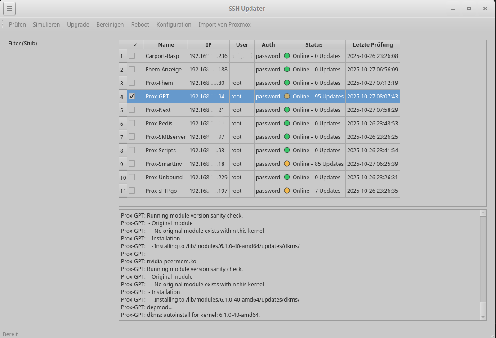

# SSH Updater

Ein **Qt/PyQt6-Tool**, um mehrere Linux-Clients/VMs auf in einem Netzwerk per SSH zu prüfen, zu simulieren und Updates auszuführen.Anzeige von Online/offline sowie zählen der Pakete des Updates.

## ✨ Features
- Hostliste mit Filterfunktion  
- Aktionen: **Prüfen**, **Simulieren**, **Upgrade**, **Bereinigen**
- Import von vorhandenen Proxmox-Clients  
- Konfigurationsdialog für Einstellungen  
- Übersichtliche Qt-Oberfläche mit Tabelle  

## 🖥️ SSH Updater Vorschau

<p align="center">
  
  <br>
  <em>Hauptfenster mit Hostübersicht, Update-Status und Proxmox-Integration</em>
</p>


## 🚀 Quickstart (Entwicklung)
```bash
# Virtuelle Umgebung anlegen und aktivieren
python3 -m venv .venv
source .venv/bin/activate

# Abhängigkeiten installieren (falls requirements.txt vorhanden ist)
pip install -r requirements.txt

# Start
python -m src.sshupdater.ui_main
```

## 📌 Roadmap
- Log- und Dry-Run-Ansicht verbessern  
- Parallel-Executor für mehrere Clients gleichzeitig  
- Erweiterte Host-Tags und Filter  

## 📄 Lizenz
MIT License – siehe [LICENSE](LICENSE)
