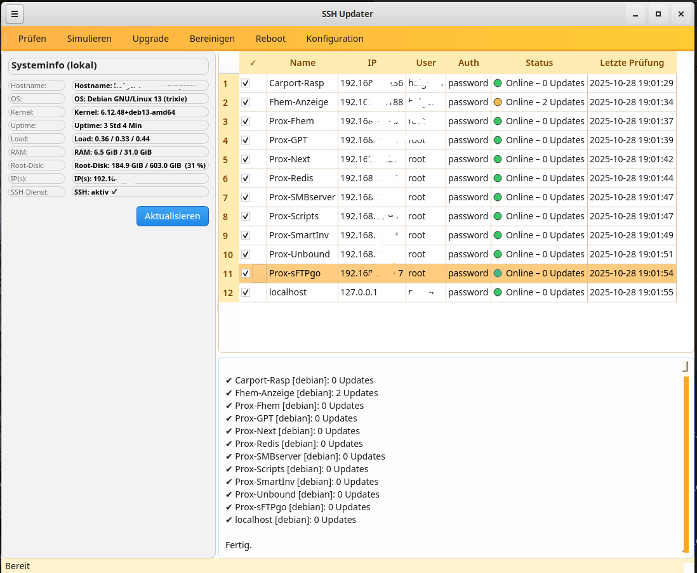
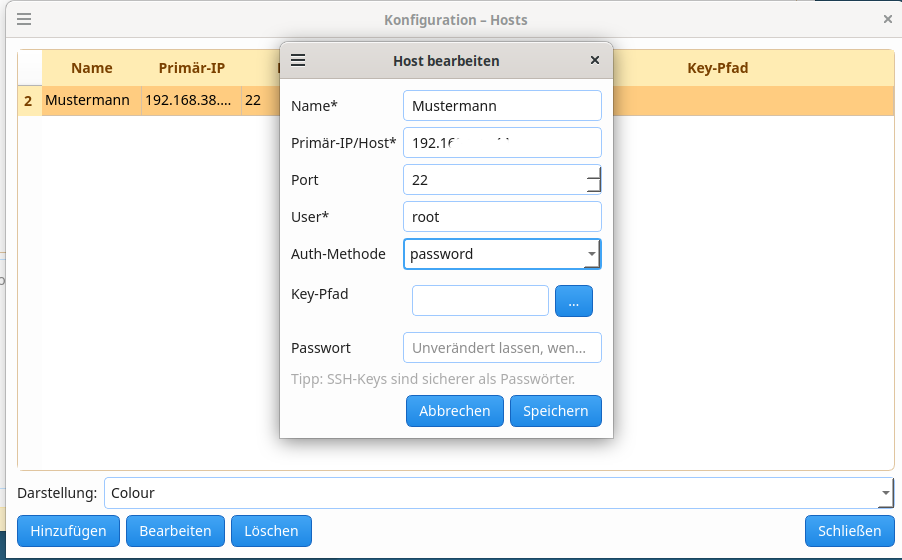

<p align="center">
  
</p>

# SSH Updater

Ein grafisches Tool zum **Verwalten und Aktualisieren mehrerer SSH-Server oder Proxmox-Container** über eine zentrale Qt-Oberfläche.  
Ideal für Administratoren, die mehrere Systeme regelmäßig prüfen, simulieren und updaten möchten.

---

## ✨ Features
- Übersichtliche Hostliste mit Online-/Offline-Status  
- Aktionen: **Prüfen**, **Simulieren**, **Upgrade**, **Bereinigen**, **Reboot**  
- Konfigurationsdialog mit Hostverwaltung und Passwortschutz  
- Mehrere Themes: Hell, Dunkel, Colour  
- Lokale Datenbank im Benutzerverzeichnis (`~/.sshupdater/`)  
- Unterstützt Passwort- und SSH-Key-Authentifizierung  

---

## 🖥️ SSH Updater – Hauptfenster

<p align="center">
  
  <br>
  <em>Übersicht aller Hosts mit Status, Update-Zähler und Log-Ausgabe</em>
</p>

---

## ⚙️ Konfigurationsansicht

<p align="center">
  
  <br>
  <em>Dialog zum Bearbeiten, Hinzufügen und Löschen von Hosts</em>
</p>

---

## 🚀 Quickstart (Entwicklung)

```bash
# Virtuelle Umgebung anlegen und aktivieren
python3 -m venv .venv
source .venv/bin/activate

# Abhängigkeiten installieren
pip install -r requirements.txt

# Start (Entwicklermodus)
./run_dev.sh
```

Oder als **Standalone-Build**:

```bash
./run_erstelle.sh
# Ausführbare Datei unter dist/ssh-updater
```

---

## 📌 Roadmap
- Der SSH-Updater soll auch headless auf dem Proxmox-Host laufen.  
- Log-Archivierung und Export  
- Optionale Statusmeldungen via Telegram  

---

## 📄 Lizenz
MIT License – siehe [LICENSE](LICENSE)
