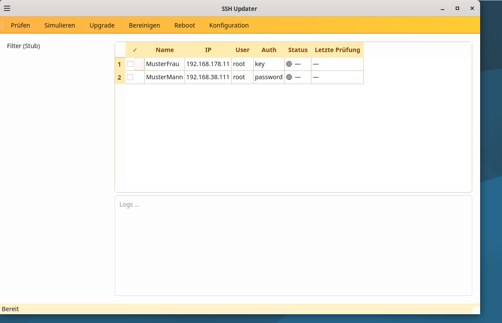
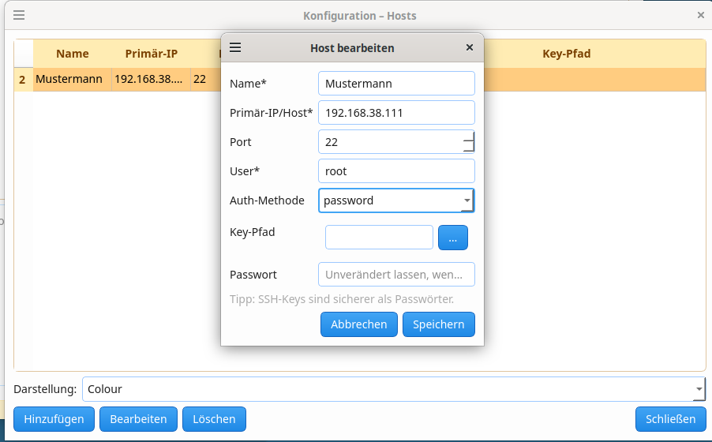

<p align="center">
  
</p>

# SSH Updater

A graphical tool for **managing and updating multiple SSH servers or Proxmox containers** through a centralized Qt interface.  
Ideal for administrators who regularly need to check, simulate, and update multiple systems.

---

## ✨ Features
- Clear host list with online/offline status  
- Actions: **Check**, **Simulate**, **Upgrade**, **Clean**, **Reboot**  
- Configuration dialog with host management and password protection  
- Multiple themes: Light, Dark, Colour  
- Local database stored in the user's home directory (`~/.sshupdater/`)  
- Supports both password and SSH key authentication  

---

## 🖥️ SSH Updater – Main Window

<p align="center">
  
  <br>
  <em>Overview of all hosts with status, update counter, and log output</em>
</p>

---

## ⚙️ Configuration View

<p align="center">
  
  <br>
  <em>Dialog for editing, adding, and removing hosts</em>
</p>

---

## 🚀 Quickstart (Development)

```bash
# Create and activate a virtual environment
python3 -m venv .venv
source .venv/bin/activate

# Install dependencies
pip install -r requirements.txt

# Start (developer mode)
./run_dev.sh
```

Or as a **standalone build**:

```bash
./run_erstelle.sh
# Executable located in dist/ssh-updater
```

---

## 📌 Roadmap
- Parallel SSH execution (run updates on multiple hosts simultaneously)  
- Log archiving and export  
- Optional status notifications via Telegram  

---

## 📄 License
MIT License – see [LICENSE](LICENSE)
