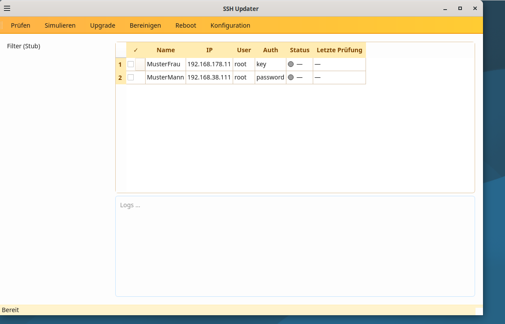
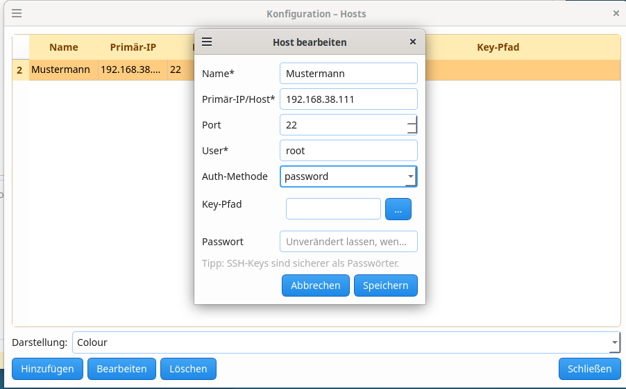

<p align="center">
  
</p>

# SSH Updater

A graphical tool for **managing and updating multiple SSH servers or Proxmox containers** through a centralized Qt interface.  
Ideal for administrators who regularly need to check, simulate, and update multiple systems.

---

## ✨ Features
- Clear host list with online/offline status  
- Actions: **Check**, **Simulate**, **Upgrade**, **Clean**, **Reboot**  
- Configuration dialog with host management and password protection  
- Multiple themes: Light, Dark, Colour  
- Local database stored in the user's home directory (`~/.sshupdater/`)  
- Supports both password and SSH key authentication  

---

## 🖥️ SSH Updater – Main Window

<p align="center">
  
  <br>
  <em>Overview of all hosts with status, update counter, and log output</em>
</p>

---

## ⚙️ Configuration View

<p align="center">
  
  <br>
  <em>Dialog for editing, adding, and removing hosts</em>
</p>

---

## 🚀 Quickstart (Development)

```bash
# Create and activate a virtual environment
python3.11 -m venv .venv
source .venv/bin/activate

# Install dependencies
pip install -r requirements.txt

# Start (developer mode)
./run_dev.sh
```

Or as a **standalone build**:

```bash
./run_erstelle.sh
# Executable located in dist/ssh-updater
```

---

## 📌 Roadmap
- The SSH updater should also run headless on the Proxmox host.  
- Log archiving and export  
- Optional status notifications via Telegram  

---

## 📄 License
MIT License – see [LICENSE](LICENSE)

## Security and upgrading to 1.2.0

The intended deployment is a personally used computer managing systems on a private
LAN. Server identity verification is mandatory even on that LAN.

### Confirming a server

In **Konfiguration**, select a host and open **Serveridentität prüfen**. Compare the
address, port and SHA256 fingerprint against the server's local console or an
independently verified source. On the server console, for example,
`ssh-keygen -lf /etc/ssh/ssh_host_ed25519_key.pub -E sha256` displays an Ed25519
fingerprint. Use the corresponding public host-key file for other key types.
Never copy the private host key. Check the confirmation box only after comparison.
Start the intended SSH action yourself afterwards.

Inspection does not authenticate to the target or run commands there. With
ProxyJump, it may authenticate to already trusted jump hosts using local keys to
reach the target. Confirm an unknown jump host first, then inspect again until the
target is confirmed. Unknown or changed keys block all actions before authentication
to that server. Replacing a changed key requires a separate explicit confirmation;
failed administrative actions never restart automatically.

Pins are stored per host/port in `~/.sshupdater/known_hosts`, using concrete public
keys in OpenSSH format. `~/.ssh/known_hosts` is neither modified nor automatically
imported. Wildcard and CA entries are not supported in the application's pin file;
servers must be able to offer an ordinary SSH public host key.

### SSH configuration compatibility

`~/.ssh/config` remains active, including AsyncSSH-supported HostName aliases,
IdentityFile, CertificateFile, IdentityAgent, IdentitiesOnly, HostKeyAlias,
ProxyJump/ProxyCommand and connection settings. The application's username and port
still take precedence, as before. Both the HostKeyAlias trust name and the connection
address are displayed. SSH configuration and proxy executables are trusted local
configuration; editing them can redirect connections.

The application overrides host trust, disables agent and X11 forwarding, including ProxyJump, hostbased and GSS
authentication, and enforces the selected authentication method. Password mode uses
only the saved password, including simple keyboard-interactive password prompts.
An explicit key file selects only that identity, including a matching certificate
from CertificateFile or automatic discovery, without additional configured identities or agent
keys. With an empty key path, configured/default keys and the local agent remain
available. Key mode never falls back to a saved password. Encrypted keys can be
provided through the local agent; this release adds no passphrase storage.

Jump hosts receive the same host-key policy and disabled forwarding. They use
key/agent authentication from their SSH configuration, never the target password.
External programs launched by ProxyCommand retain their own settings; the application
controls the SSH sessions it creates itself.

### Existing data and permissions

Changing host/IP, username or port requires re-entering or explicitly removing a
stored password. Switching to key authentication at the same target offers an
explicit keep/delete choice. There is no automatic credential deletion on upgrade.
Newly entered SSH passwords use **Credential V2**. Its Fernet-encrypted, authenticated
payload binds the password to the stable `hosts.id`, stored host/alias string, username
and port. Display names, tags and check results are not part of the binding. There is
no DNS normalization.

Existing Legacy/V1 passwords are preserved unchanged. Before the next password login,
each affected host requires an explicit confirmation showing its name, target, username
and port with an **empty password field**. Only re-entering the password and choosing
“Als V2 speichern” creates V2. Cancelling preserves the old token and prevents the action
from starting; individually confirmed hosts stay confirmed. Re-entering the password in
host configuration is also supported. The old plaintext is never displayed or prefilled,
and legacy tokens are never automatically repackaged. **Key-based hosts are unaffected**,
even if an old password is retained.

Immediately before each SSH connection, an immutable context is read from one database
row, including target, username, port, authentication method, key path and credential.
If it differs from the worker's snapshot, the action is rejected. V2 is checked against
exactly that context. Unknown versions, damaged payloads and binding mismatches fail
closed without a legacy fallback. Unlock checks cryptographic readability for V1 and
additionally validates structure and host binding for V2.

Existing v1.2.2/v1.2.3 databases remain readable without schema migration. The master
password, PBKDF2 parameters, vault key, `vault.salt` and `vault.verify` remain unchanged
in this release. There is no automatic credential deletion or re-encryption.
**Host-key pinning remains a separate protection layer**; the truststore is not migrated.
V2 binds the stored host identity, not DNS results or external SSH configuration changes.
Whole-database rollbacks and vault clones are not detected. Older application versions
cannot read V2; downgrading requires a matching backup made before the first V2 write.
Incomplete vaults are not silently re-created.

On POSIX, the data directory is restricted to `0700` and known application files to
`0600`, including existing installations. Unexpected owners, symlinks and hard-linked
files cause an error rather than automatic ownership changes. Existing symlink-based
storage needs a deliberate move to a regular data directory; the application does
not move data. This does not implement Windows ACL hardening.

A memory-hard KDF with versioned migration, further log hardening and automatic
vault locking are reserved for a later release.

The release uses Python **3.11.x** (`release-python.txt`; tested with 3.11.16), AsyncSSH **2.24.0 with a pinned upstream transport fix**,
Cryptography **50.0.1**, PyQt6 **6.11.0** with Qt **6.11.2**, and PyInstaller **6.22.3**. Runtime and transitive dependencies
are pinned in `requirements.txt`; build dependencies are pinned in `requirements-build.txt`.
Create a clean environment with that Python version and install `requirements-build.txt`.
The local build script checks Python and runs tests before building; Linux and Windows release CI
uses the same versions and tests. Package pins do not imply bit-identical OS images.
The AsyncSSH update includes key-exchange hardening and proxy/configuration fixes,
not merely warning suppression ([changelog](https://asyncssh.readthedocs.io/en/latest/changes.html)).
Cryptography aligns the previously different local/release versions; 50.0.1 wheels
include OpenSSL 4.0.2 ([changelog](https://cryptography.io/en/latest/changelog/)).
Regression tests verify unchanged Fernet/PBKDF2 compatibility, mixed V1/V2 vaults,
host binding, explicit confirmation and consistent connection snapshots.

External known_hosts files cannot grant application trust, including for ProxyJump.
Only raw public host-key algorithms are offered, respecting HostKeyAlgorithms restrictions;
host certificates/CA trust are unsupported. Client certificates remain supported.
Missing vault files with existing encrypted data, damaged salts and credentials which
do not match the unlocked key cause a non-destructive error. Interrupted initialization
leaving only one vault file is also rejected, without automatic repair or deletion.

Run tests with `.venv-release/bin/python -B scripts/test_release.py`.
Security tests use temporary data and local SSH servers on `127.0.0.1`, requiring
permission to open local sockets. They do not administer real managed systems.

### Output limits and stopping local waits

All remote output is plain text; HTML, entities and SVG data URLs are not rendered.
The log retains up to 2,000 blocks and 16,384 characters per entry. Older blocks
are discarded and oversized entries truncated. Combined stdout/stderr is limited
to 4 MiB for queries and 16 MiB for streaming commands. Connections including
ProxyJump have a 20-second deadline. Queries have a 90-second timeout (reboot:
10 seconds); streaming commands have a one-hour deadline and a five-minute idle
timeout. Streaming lines are batched before display.

**Stop ends local waiting and skips the remaining selected hosts.** Timeout,
output limit or connection loss after an administrative action starts means
“Remote state unknown”. No kill/terminate signal is sent; the SSH connection is
closed. The remote process may continue or react to disconnection. Check the host
before retrying. Failed simulations report errors. Autoremove requires confirmation
and excludes hosts without successful simulations. DNF uses `check-update` with
exit codes 0/100 to preview available updates, not a full transaction plan.
Arch `checkupdates` exit code 2 means no updates.

### Local release builds

`run_erstelle.sh` creates/uses a separate Python 3.11 `.venv-release`, installs the
runtime/build pins, checks the environment, dependencies and tests, builds the
binary and runs its offline `--smoke-test`. Override `SSH_UPDATER_PYTHON` and
`SSH_UPDATER_RELEASE_VENV` to select another interpreter/isolated environment.
The test runner isolates home lookups and Qt settings. The offline smoke test
uses no vault files, SSH agents or managed hosts.

`dist/` contains ignored local build output, not proof of a current release.
Use only the result of a fully successful current build; an existing binary may
be stale. Release workflows require a strict `vMAJOR.MINOR.PATCH` tag matching
`__version__` and use it in archive names. Only the final release job has write
permissions.

### Final security review changes

AsyncSSH uses the unmodified, unreleased upstream revision
`459f44515238880b7be68299bb7d1fc0e704121d`, pinned by archive SHA256. It still
reports 2.24.0 internally and must not be replaced with PyPI 2.24.0. The release
check verifies installed archive provenance: [transport limit](docs/transport-limit.md).

Application processes explicitly disable PTYs even with `RequestTTY force`.
Idle deadlines cover process requests, output and channel closure. All six action
workers support local cancellation; no later hosts start after cancellation, and
stopped autoremove simulations never launch cleanup. Closing the window requests
local cancellation and waits for local workers. No remote package-manager kill
signals are sent; unknown remote outcomes remain marked as unknown.

APT index updates use `--error-on=any` to stop subsequent steps on transient errors
too. Older APT versions lacking this option fail explicitly without an unsafe
fallback. Other index warnings remain visible in checks and simulations.
