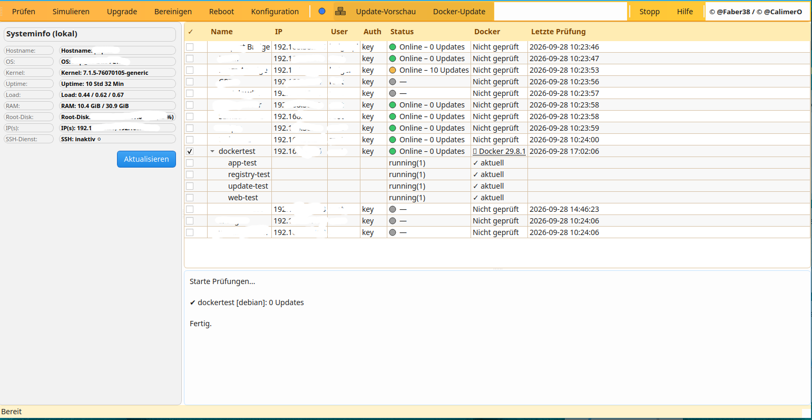

<p align="center">
  
</p>

# SSH Updater

SSH Updater is a desktop tool for managing and updating your own or trusted Linux
systems over SSH within a controlled, secure LAN. It combines a multi-host
overview, package checks and system updates, SSH host-key verification,
Docker/Compose support, and local offline help. SSH-accessible VMs and containers
can also be managed as hosts.

Stable release: **v1.2.4** · Current development version: **v1.2.5-beta5**
[Deutsche README](README.md)

## Features

- Host list with status, update counts, and log output
- Check, simulate, and install updates; restart systems
- Remove unused packages on Debian-based systems
- Support for Debian/Ubuntu, Fedora/RHEL, and Arch, plus selected derivatives
- Host management with password or SSH key authentication
- Master password to protect stored SSH passwords
- Themes: **Hell** (Light), **Dunkel** (Dark), **Standard**, and **Colour**; the saved
  theme is applied automatically at startup
- Local application data stored in `~/.sshupdater/`
- Docker Engine/Compose discovery, indented project rows with independent host
  and project selection, and a Docker detail view
- Read-only image checks against the same configured registry tag, conservative
  status reporting when a comparison is inconclusive, and controlled updates
- Registry metadata cached only in RAM; registry rate limits are respected
- Offline help covering setup, SSH, system actions, Docker, security, and troubleshooting

## Interface

The host table groups Compose projects under their hosts. The toolbar has a
separate container group and a **Hilfe** (Help) entry.



*SSH Updater with expanded Docker/Compose projects using the Colour theme.*

## Installation / Quickstart

### Release Binary

- **Linux x86_64:** extract the `.tar.gz` release archive and run `./ssh-updater`.
- **Windows x86_64:** extract the `.zip` release archive and run `ssh-updater.exe`.

A graphical desktop is required. These build targets do not imply compatibility
with every Linux distribution or Windows version. The development version above
is not a claim that a beta release archive has been published.

### From Source on Linux

Use the Python version specified in [release-python.txt](release-python.txt),
currently **3.11.x**. From the project directory:

```bash
python3.11 -m venv .venv
source .venv/bin/activate
python -m pip install -r requirements.txt
./run_dev.sh
```

Create the environment and install dependencies first: `run_dev.sh` does neither.

Target systems need SSH and the appropriate package manager. Administrative
commands require sufficient permissions; commands using `sudo` must run without
a password prompt. On Arch, update checks require `checkupdates` from
`pacman-contrib`. APT must support `--error-on=any`; reboot requires `systemd-run`.

### First Launch / Master Password

On first launch, set and confirm a master password. On subsequent launches,
unlock the local vault with that password. This is required even when using only
SSH keys. The master password protects locally encrypted credentials; see the
in-app help for details. New vaults use scrypt and require at least twelve
characters. Existing vaults migrate after a successful unlock. An existing host-key
trust store without an integrity tag is never accepted automatically; every server
fingerprint must be confirmed again through an independent source. See the
[hardening notes](docs/security-hardening-v1.2.5.md) for the migration details.

## Basic Usage

1. Open **Konfiguration** (Configuration) and add hosts with their address, username,
   port, and password or SSH key.
2. For each new host, open **Serveridentität prüfen** (Verify server identity).
   Compare the displayed fingerprint with the server console or an independently
   verified source, and confirm only if it matches.
3. Select the desired hosts in the main window and use **Prüfen** (Check) to look for
   updates. **Simulieren** (Simulate) shows a preview without performing package
   upgrades. For DNF and Arch, this is an update overview, not a full transaction plan.
4. Use **Upgrade** to install updates. On Debian-based systems, **Bereinigen** (Clean)
   first simulates the removal of unused packages and asks for confirmation.
   **Reboot** schedules a restart of the target system.
5. Review results and error messages in the log.

**Prüfen** and **Simulieren** may refresh package lists, but do not install
packages. System upgrades can update Docker Engine/Compose packages on the host;
Compose image/container updates use the separate Docker workflow below.

**Stopp** (Stop) ends local waiting and skips the remaining selected hosts.
A remote process that has already started may continue running. After a timeout or
connection loss, the target's state may also be unknown; before retrying, check
whether the action is still running or has already finished on that system.

## Docker / Compose

After a host check, discovered Compose projects appear indented below their host.
Host checkboxes select system actions; project checkboxes select Docker/Compose
actions. Neither selects the other. Clicking the Docker display opens details
from the last check without another remote query.

The image check compares the running image with **the same configured tag**:
`nginx:1.28-alpine` against `nginx:1.28-alpine`, never automatically selecting
`nginx:1.29-alpine`. An inconclusive check reports an incomplete result rather
than guessing that an image is current or needs updating.

1. Select a Compose project and open **Update-Vorschau** (Update preview): a
   read-only plan using the last check, not a Docker simulation.
2. **Docker-Update** performs a fresh live preflight, then pulls only approved
   update services. Pulling does not replace running containers.
3. **Docker anwenden** (Apply Docker) checks the prepared state again and recreates
   those services with the downloaded image, without another pull or build.
4. **Docker prüfen** (Verify Docker) performs the final read-only local/registry
   verification. Only a conclusive result completes verification.

A later registry error does not undo a successful Apply. Verification remains
pending; a changed registry tag can instead yield a new update candidate.
Registry metadata lives only in session RAM (30-minute TTL), while local
container data is read afresh. Rate-limit backoff is respected; restarting the
application discards the cache and prepared update states.

### Requirements and Limits

Docker Engine, Compose, and Buildx for registry metadata checks must be available
to the SSH user noninteractively. Compose support is deliberately conservative:
one unambiguous local Compose file and suitable `image:` references, including
a normal local project `.env` in the same directory. External/multiple env files,
service `env_file`, shell application variables, overrides, includes, extends,
profiles, and complex interpolation remain excluded. See the in-app help and
[technical Docker documentation](docs/docker-image-updates.md) for details. Swarm and
Kubernetes are not supported as the normal Compose update path.

No automatic higher-tag selection, Compose-file edits, digest-pin changes, local
image builds, registry login, `docker compose down`, image/system prune, deletion
of old images, rollback, or application-specific backups/migrations are performed.
Existing registry credentials on the target may be used by Docker itself; the
metadata cache stores no credentials.

**Application preparation remains essential:** an available image update is not
proof that an application can safely be upgraded immediately. Stateful services
may require backups, snapshots, migrations, release-note review, and a prescribed
upgrade order. SSH Updater automates the technical Compose image workflow; the
application's own upgrade instructions remain authoritative.

## Local In-App Help

**Hilfe** opens a fully local, offline manual with 20 topics covering setup, hosts,
SSH, system actions, Docker/Compose, security, and troubleshooting. No internet
connection is required for the manual. Use it for detailed operating instructions.

## Intended Use and Security

SSH Updater is intended for your own or trusted systems within a **controlled,
secure LAN**. It is not designed as a public internet admin portal, multi-tenant
system, Zero Trust gateway, or bastion/jump-host replacement.

A trusted LAN does not replace SSH key protection, host-key verification,
appropriate permissions, or backups/snapshots before critical changes.

SSH Updater authenticates its application-owned host-key trust store and decrypts
stored SSH passwords only after a successful pin check. Production connections use
the address, port, and user stored by the application and do not load the user's
OpenSSH configuration.

The tool includes appropriate safeguards for this purpose. However, it is not a
high-security solution for already compromised clients or hostile local
environments. Attackers with full access to the user account, the running process,
or local application files are outside the intended threat model. Concrete,
verifiable security issues continue to be taken seriously and addressed where
possible.

## Security at a Glance

- Server identities are verified through host-key checks. Unknown or changed keys
  must be explicitly checked and confirmed before authentication, for example after
  reinstalling a server.
- Password and SSH key authentication are supported. Newly stored passwords are
  encrypted and bound to the corresponding host configuration, including target,
  username, and port. Existing older passwords must be entered again once before
  the next password login.
- Agent and X11 forwarding are disabled for SSH connections established by the
  application itself.
- Remote output is treated as plain text. Actions have time and output limits and
  can be stopped locally with **Stopp** (Stop).

Root is not universally required. For deliberately administered Docker hosts in
this controlled environment, **root + SSH key** is a robust supported setup,
not a recommendation for root password login or blanket sudo permissions.
Docker daemon access grants extensive host privileges: do not unnecessarily
expose its socket/API on the network. SSH Updater uses the configured SSH access.
Protect private keys and never blindly accept unknown or changed host keys.

## Development / Build

To create a local standalone binary on Linux:

```bash
./run_erstelle.sh
```

The script uses a separate Python 3.11 environment in `.venv-release`, installs the
pinned dependencies, runs the tests, and builds `dist/ssh-updater` with PyInstaller.
It then checks the binary with a smoke test. Use only the result of a successfully
completed build.

Tests can also be run separately in the configured build environment:

```bash
.venv-release/bin/python -B scripts/test_release.py
```

Dependencies are listed in [requirements.txt](requirements.txt) and
[requirements-build.txt](requirements-build.txt).

## Technical Documentation

Architecture and security details for developers; the primary user manual is
available in the application. The Docker documents are currently in German.

- [Compose discovery](docs/docker-compose-discovery.md)
- [Image checks and registry session cache](docs/docker-image-updates.md)
- [Live preflight](docs/docker-preflight.md)
- [Targeted image pull](docs/docker-image-pull.md)
- [Apply and container checks](docs/docker-apply.md)
- [Final verification](docs/docker-verification.md)
- [SSH transport limits](docs/transport-limit.md)

## Project and Contributors

Project responsibility: **Holger Mangold**. Contribution/support: **Calimero**.
The GUI credit reads `© @Faber38 / © @CalimerO`.

AI-assisted tools supported development, code analysis, testing, and
documentation. Decisions, review, and approval of changes remain the
responsibility of the project owner.

## Possible Future Extensions

Non-binding ideas, with no release commitment:

- Headless operation on a Proxmox host
- Log archiving and export
- Optional status notifications via Telegram

## License

MIT License – see [LICENSE](LICENSE).

Copyright (c) 2025 Holger Mangold
